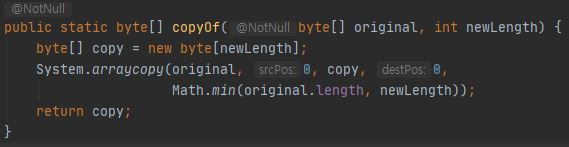

## System.arraycopy(), Arrays.copyOf()

StringBuilder의 append() 메서드를 살펴보던중 다음과 같은 메서드를 발견하게 되었다.

<br>

배열을 복사하는 메서드는 System.arraycopy() 밖에 몰랐기 때문에 Arrays.copyOf() 메서드는 System.arraycopy()와<br> 어떻게 다른지 인터넷을 찾아봤다.

```
    int[] arr = {1,2,3,4,5};
    int[] sysCopyArr = new int[10];

    System.arraycopy(arr, 0, sysCopyArr, 2,5);

    // [0, 0, 1, 2, 3, 4, 5, 0, 0, 0]
    System.out.println(Arrays.toString(sysCopyArr));

    int[] copyOfArr = Arrays.copyOf(arr, 5);
    // [1, 2, 3, 4, 5]
    System.out.println(Arrays.toString(copyOfArr));
```

System.arraycopy()메서드는 존재하는 배열에 값을 복사하고, Arrays.copyOf는 새로운 배열을 생성해서 값을<br> 복사한다.

Arrays.copyOf() 메서드가 어떻게 구현되었는지 찾아보니 다음과 같았다.

<br>

Arrays.copyOf()는 내부적으로 System.arraycopy()를 사용한다.
