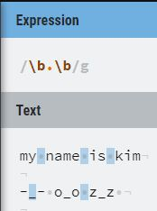
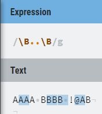

## 정규표현식 \b와 \B 

### \b
단어 경계에 대응한다. 
\w( [A-Za-z0-9_] )와 그 외의 문자사이의 경계에 대응한다. 
 

y n은 \w와 그 외의 문자 사이의 경계에 대응된다. (y와 n은 \w, 공백은 \w 외의 문자) 
-_-도 마찬가지로 \w와 그 외의 문자 사이의 경계에 대응 (-은 \w외의 문자, _는 \w) 

### \B
단어 경계가 아닌 부분에 대응된다. 
\w는 \w와의 경계와, \w가 아닌것은 \w가 아닌것의 경계와 대응한다. 
 

첫 번째, AA의 경우 앞도 \w, 뒤도 \w이므로 대응된다. 
두 번째, BB의 경우도 AA와 같다. 
세 번째, B 의 경우 B의 앞은 \w, 공백의 경우 뒤는 \w외의 문자(느낌표)이므로 일치 
네 번째, @A의 경우  @의 앞 !는 \w외의 문자, A의 뒤 B는 \w이므로 일치

